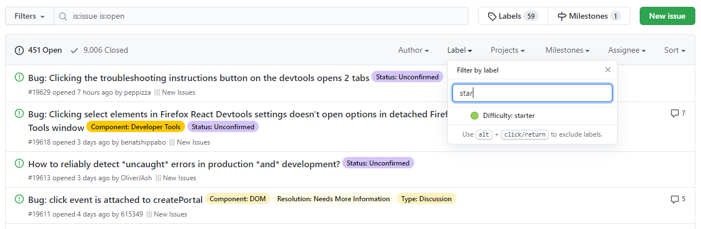

# Referêncial Teórico

## Software livre: Visão

## Tecnologias em software

### Github
GitHub é um repositório social para projetos de código aberto baseado no sistema de controle de versão Git. Sua principal função é facilitar o compartilhamento e a colaboração do código no projeto. Mas também é uma ótima ferramenta de aprendizagem. O objetivo principal é centrado para desenvolvedores que atuam de forma autônoma, embora possua suporte para equipes e empresas, ele se destaca em produção de projetos de software livre sendo uma das principais formas de entrada para novos desenvolvedores no mundo do código aberto, sendo possível fazer contribuições de novas funcionalidades, apresentar problemas de uso e interagir com o resto da comunidade.

Existem outras ferramentas de versionamento de projeto no mercado, tais como o Gitlab, que também possui um controle de versão pelo Git, porém mais voltado para a inciativa privada, já que possui funcionalidades que permitem deploys automatizados, criação e gerenciamento de issues voltadas a equipe e outros utilitários mais voltados à etapa de entrega/produção. Há também o GitBucket, voltado para o mercado privado, embora, em qualquer dos casos, qualquer um dos três podem ser usados tanto para comunidade aberta, quanto privada. Como o Github possui uma gama de projetos e desenvolvedores inclusos na plataforma maior que as outras, ele será utilizado como base de pesquisa, além de possuir uma API restful que pode permitir ao estudo, minerar dados de repositórios e relacionar com seus usuários/linguagens mais usadas e outras métricas adquiridas que outras plataformas não conseguem prover de suporte.

Para que um novato possa começar a contribuir no github em comunidades *open-source*, é necessário entender alguns conceitos que são utilizados dentro do espectro do Git, os principais e mais básicos termos são: *fork*, *commit*, *merge* e *branches*. Realizar um *fork* de um projeto realizará uma cópia do projeto para a conta do usuário no exato momento/estado do repositório em que houve a ação, assim, um novo usuário pode ter acesso próprio do código e alterá-lo a maneira que desejar e como todo o código fica online, é necessário baixar o conteúdo para a máquina local para realizar as as alterações desejadas, quando terminar, ele pode fazer *commits* que são entradas de códigos adicionados no projeto, esses códigos são como novas versões/estados do projeto no ponto inicial, a cada novo *commit* uma versão é criada para o projeto para aquele ponto. Existe também comandos do git que realizam operações sobre esses *commits*, chamados de *pull* e *push*, são ações que, respectivamente, enviam seus *commits* para serem salvos no projeto, e recebem a versão mais atualizada do projeto na máquina local, mantendo uma sincronização com o que está online.

Esses projetos, também conhecidos como repositórios, podem ter *branchs*, que são como uma bifurcação organizacional do projeto, ou seja, assim como o *fork*, são pontos do projeto separado da raiz principal que possui um objetivo, na prática, quando algum problema é encontrado ou uma nova funcionalidade será adicionada, é criado uma *branch* com a versão atual do repositório, essa *branch* terá o objetivo de resolver ou adicionar uma funcionalidade no projeto de forma unitária, assim que for terminada o responsável poderá fazer um *pull request*, ou seja, um pedido para adicionar as mudanças feitas na *branch* trabalhada na raiz principal do projeto, a qual, por padrão é chamada de *master*. Esse é o fluxo que um novato precisa entender para entrar em um projeto, nele, haverá *issues*, ou seja, tarefas/discussões sobre um determinado tema, o novato poderá então criar uma *branch* relacionado com o que está sendo proposto na discussão, e ao terminar, submeter essa solução a comunidade, o esperado é haver pessoas responsáveis em analisar as mudanças e autorizar ou não o pedido do *merge*, caso estiver tudo certo, seguindo os padrões de cada comunidade, as mudanças são aprovadas para a *master* e com o tempo entram em produção, ou sejam, começam a rodar como uma funcionalidade padrão do sistema.

Atualmente, o Githut possui [https://octoverse.github.com/] mais de 40 milhões de desenvolvedores e conta com um portfólio maior de 44 milhões de repositórios com sua grande parte de código aberto. E, além de possuir um modelo organizacional de versionamento *frok - pull-request*, existem diversas funcionalidades que contribuem com a organização de tarefas e discussões, a principal é a rotulação, como mostra a imagem NUM_IMAGEM

é possível anexar rótulos, chamadas de *labels* ou *tags* que ajudam a um novato localizar tarefas de nível mais baixo e com maior facilidade de resolução. Outras funcionalidades como: adição de tempo previsto para executar a tarefa, um fórum com links úteis e bots de inicialização de tarefas são ferramentas que também auxiliam usuários a dar um primeiro passo dentro de um projeto, embora, a implementação dessas funcionalidades dependem inteiramente da comunidade/dono do projeto. 

## Barreiras enfrentadas por novatos em projetos de software

## Problemas para montar ambiente e replicar issues

## Virtualização em Software Livre

### FRISK

### Trabalhos relacionados com replicação de issues e posts usando docker

## Considerações finais