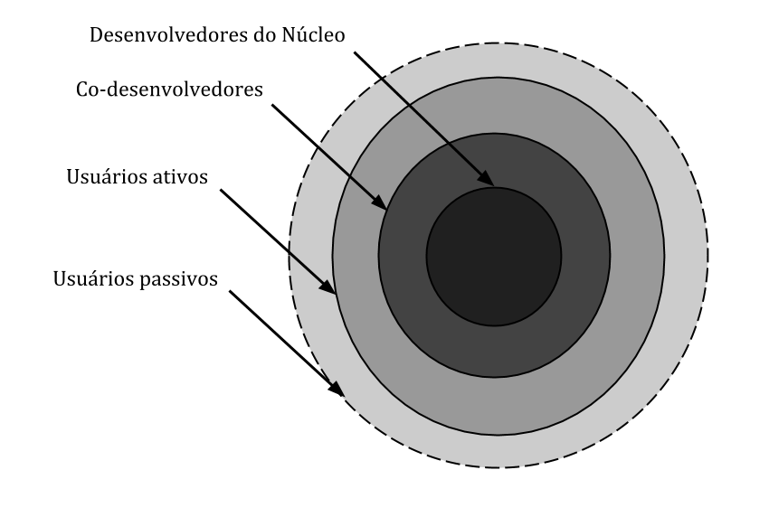

# Referêncial Teórico

## Software livre: Visão geral

Com o paradigma da tecnologia como um produto e a revolução da forma de propagar informação que se deu ao longo das três últimas décadas, a comunidade de software livre se tornou um polo concentrado para aprendizado e disseminação de informações, movido inicialmente por estudantes e pesquisadores e que até mesmo atinge uma porcentagem do setor privado, o software de código aberto é feito por muitas pessoas e distribuído sob uma licença que concede a todos os direitos de usar, estudar, alterar e compartilhar o produto na forma modificada e não modificada. Segundo {kelty2001free}, a liberdade de software é essencial para permitir o desenvolvimento comunitário de código aberto.

O desenvolvimento e contribuição em comunidades de software livre acontece com a disponibilização do código fonte de uma aplicação, projeto ou produto, usualmente pela internet com um nível de permissão dado por uma licença de uso, ou seja, alguns produtos, mesmo sendo de código aberto, não permitem o compartilhamento de código por terceiros, somente pelo disponibilizador principal, enquanto outros possuem licença completa para alterações e compartilhamento. Uma vez disponível para uso e alteração, um membro da comunidade pode adquirir uma versão própria do sistema e realizar ações sobre ela, discutir melhorias com o resto da comunidade e propor mudanças, é assim que softwares livres evoluem com o tempo.

A estrutura da comunidade varia de acordo com o tipo do projeto, a forma em que o projeto foi construído e a estrutura de liderança na criação do projeto, por exemplo, é muito comum encontrar em comunidades pessoas chamadas de *mantainers*, responsáveis por aprovar modificações que são propostas pela comunidade, os *forum dealers*, que analisam discussões de fórum e garantem a não-redundância em discussões e tarefas criadas, mantém a comunidade centrada nos objetivo de cada tópico de discussão, há também os colaboradores, que podem ser separados em níveis de experiência dentro da comunidade, são pessoas que programam soluções que são aceitas pela comunidade e aprovadas para o projeto. Quando um novato entra para uma comunidade, normalmente é atribuído a ela o título de *newcomer*, um recém-chegado, que ainda não entende a regra de negócio nem sobre o funcionamento e a organização do projeto mas quer ajudar a produzir soluções, para eles, algumas comunidades dispõem tutorias de como realizar a instalação do software, quais são os primeiros passos e até mesmo algumas discussões de nível baixo para incentivar a colaboração com a comunidade.

Apesar de existirem diversas maneiras de organização para uma comunidade, segundo (Crowston e Howison (2005)) a maneira em que uma comunidade se comporta de forma genérica pode ser ilustrada na FIGURA

onde existem desenvolvedores núcleo, co-desenvolvedores, usuários ativos e usuários passivos. Os desenvolvedores núcleo equivalem, ao que foi visto anteriormente como os *mantainers* e organizadores do projeto, ou seja, é todo o pessoal que contribui de forma mais contínua e possui um nível de permissão maior sobre o projeto e em alguns casos, essa camada é preenchida apenas por um painel de usuários que colaboraram com a ideia como fundadores, qualquer novo contribuidor assume uma função abaixo deles. Ainda em um nível alto na hierarquia, co-desenvolvedores são a camada de programadores e usuários que então mais por dentro das tecnologias utilizadas no projeto e possuem um alto nível de contribuição com a comunidade, atuam em fóruns como intermediadores, já que possuem conhecimento sintético sobre a regra de negócio, funcionalidades e tecnologias.

Logo abaixo deles, existem as camadas de usuários, que compõe grande parte da comunidade em si, ambos utilizam o sistema como um usuário final, utilizando de seus recursos e funcionalidades, embora que um usuário ativo seja mais presente em fóruns, apensar de não contribuir diretamente com o código fonte, apresentam e levantam *bugs* e melhorias, mantendo o ciclo de vida das discussões e do projeto como um todo, ao contrário do usuário passivo, camada que menos tem contato com o código em si, só utilizam o sistema na ponta do processo de uso, eles são a maior parte da comunidade em diversos tipos de projetos.

Um *newcomer* entra na comunidade em geral como um usuário passivo e passa com o tempo a se tornar um usuário mais ativo na comunidade até o ponto de querer não só contribuir com discussões, mas também com geração de códigos, a partir do ponto que ele contribui diretamente para o código ele se inclui na camada de co-desenvolvedor, dando suporte a *issues* menores até adquirir mais conhecimento. Como a comunidade de software livre é voltada e formada por programadores geograficamente espalhados pelo globo, podem existir barreiras diversas para um usuário se tornar um co-desenvolvedor de maneira mais clara, como a falta de comunicação direta, entendimento sobre a tecnologia e como rodar o projeto na sua própria máquina para iniciar o processo de contribuição.

## Tecnologias em software

A contribuição com software livre é um paradigma moderno que surge para que seja possível a criação e disseminação de tecnologias de informação e comunicação entre a sociedade, ele consiste na contribuição de maneira voluntária de programadores da comunidade para que seja possível o desenvolvimento de *softwares* no geral. Para que isso fosse possível, houve a necessidade de criar ferramentas e plataformas de administração para organizar todo o processo de desenvolvimento, alguns exemplos são o *GitHub*, *Gitlab* e o *Stack Overflow*. O  *GitHub* e o *Gitlab* são plataformas que possibilitam a hospedagem de código, oferecem  ambientes de codificação e fornecem compartilhamentos de dúvidas da comunidade no geral, diferente do *Stack Overflow* que  apenas oferece uma ampla comunidade para que dúvidas de desenvolvimento de software possam ser sanadas.

Este estudo irá focar principalmente nas áreas dessas ferramentas de desenvolvimento de software livre voltadas para responder perguntas da comunidade, onde muitas vezes será necessário a criação de ambientes de trabalho que serão mais complexos do que responder as dúvidas em si. Desta forma uma gama de plataformas com objetivos diferentes como já citados no parágrafo anterior terão impactos diretos neste artigo.

### Github

## Barreiras enfrentadas por novatos em projetos de software livre

A comunidade de software livre possui constantes contribuições voluntarias todos os dias, essas contribuições são realizadas por pessoas da comunidade com tipos diferentes de experiencia, sejam elas de desenvolvimento de softwares, linguagens de programação distintas ou até mesmo diferenças culturais e geográficas como idioma nativo ou costumes sociais. Para o contexto de software livre, um novato é aquele que deseja contribuir pela primeira vez com um software livre, e não necessariamente aquele que entende melhor de linguagens de programação ou de desenvolvimento de softwares e são dessas pessoas que esta seção irá retratar.

O artigo {Steinmacher2015barries} realiza um estudo baseado na experiencia e observação de alunos que contribuíram para a comunidade de softwares livres. A pesquisa aponta que foram encontradas 58 barreiras subdivididas em 6 categorias que impedem ou dificultam a entrada de novatos, são elas: Problemas de recepção, características do novatos, novatos que necessitam de orientações, problemas de documentação, diferenças culturais e obstáculos técnicos. Outros estudos como o {jensen2011joining} avaliam também que novatos que recebem e-mails em um curto espaço de tempo tendem a participar mais de projetos, já aqueles que recebem e-mails negativos ou que não recebem nada tendem a se interessar menos pelos projetos, seja por achar que as pessoas estão com pouco interesse em seu trabalho ou por medo de que estejam fazendo algo de errado.

Estas barreiras acabam gerando desistências que poderiam ser evitadas, o que faz com que algumas pessoas desistam desse ambiente e acaba por enfraquecer o desenvolvimento de software livre no geral. Este artigo irá focar nos problemas técnicos e de recepção que os novatos possuem, tentando gerar uma alternativa para que eles possam ingressar com menos dificuldade no mundo de desenvolvimento de softwares livres.

## Problemas para montar ambiente e replicar issues

É comum na areá da computação se deparar com a necessidade de criação de ambientes de trabalho únicos para a implementação de um projeto, esta é uma tarefa simples quando uma funcionalidade esta sendo criada, porém ao replicar *issues* esse processo se torna um pouco mais complexo.

Todo projeto é iniciado com ideias do seu criador, essas ideias são feitas a partir de ferramentas, e as mesmas necessitam de um ambiente único para aquela junção de componentes. Quando alguém conhece todas as ferramentas utilizadas e sabe de suas necessidades, montar um ambiente de trabalho para aquele projeto pode não ser um problema muito grande, todavia quando estamos falando de contribuição com projetos de *software livre*, ou ajudar a responder duvidas de terceiros em sites como o *Stack Overflow* você pode conhecer o problema e até mesmo algumas funcionalidades, porém todos os detalhes que dificultam a criação de um ambiente de trabalho é difícil de se possuir.

Outro problema enfrentado para replicar ambientes de trabalho é que maquinas com sistemas operacionais (SO) diferentes podem gerar ambientes de trabalhos distintos. Isto faz com que surja um nível de complexidade maior na geração de SO, pois mesmo que o criador de uma *issue* tente ajudar na criação do mesmo e coloque algum tipo de tutorial ou tabela de ferramentas que devem ser instaladas, as mesmas precisam ser feitas para *Windowns*, *Linux*, *Mac* ou qualquer outro sistema operacional que possa ser utilizado para a implementação do seu projeto, o que muitas vezes gera um trabalho grande de mais para um problema que poderia ser respondido com bem menos.

## Virtualização em Software Livre

Uma das tecnologias que vem crescendo no mercado de tecnologia para virtualização de aplicações é o Docker, utilizado em *deploys* de aplicações com o conceito de containers, diferentemente do método tradicional com máquinas virtuais rodando para manter a aplicação, o Docker se destaca pela praticidade e capacidade de gerenciamento de memória e processamento. O seu funcionamento está, como mostrado na FIGURA

relacionado com a estrutura de execução de aplicações num mesmo servidor. Os contêineres são uma abstração na camada do aplicativo que agrupa o código e as dependências. Vários contêineres podem ser executados na mesma máquina e compartilhar o kernel do sistema operacional com outros contêineres, cada um executando como processos isolados no espaço do usuário. Os contêineres ocupam menos espaço do que as MVs (as imagens dos contêineres normalmente têm dezenas de MBs de tamanho), podendo lidar com mais aplicativos e exigindo menos MVs e sistemas operacionais.

Já, as máquinas virtuais (MVs), sendo abstrações do hardware físico que transformam um servidor em vários servidores fazem com que o hipervisor, que é um *software* ou *firmware* que roda as máquinas virtuais, permita que várias MVs sejam executadas em uma única máquina física. Cada MV inclui uma cópia completa de um sistema operacional, o aplicativo, binários e bibliotecas necessárias - ocupando dezenas de GBs. As MVs também podem ser lentas para inicializar.

Os usos do Docker podem ser vários, desde ajudar a rodar projetos locais com o intuito de testar tarefas e executar funcionalidades sem precisar ter que instalar dependências de projetos na máquina física, até mesmo para rodar *pipelines* em sistemas para testes automatizados e verificação do linter (uma ferramenta que analisa o código-fonte para sinalizar erros de programação, bugs, erros estilísticos e construções suspeitas) antes de realização de *deploys* para produção, também sendo possível integrar funções em conjunto com Docker, como cache de projeto que diminui o tempo de execução de um *container* e automatiza ainda mais as tarefas de cotidiano num projeto.

Ferramentas como Gitlab e Github já possuem integrações para *deploys* automáticos com docker, e utilizando compactação e extração de *cache*, até sendo possível rodar um *build* antes de colocar uma nova versão de um sistema no ar, bastando apenas criar arquivos de configurações *docker-compose.yml* e *Dockerfile* do próprio Docker. Além delas, outras empresas como Amazon Web Services (AWS) e Microsoft Azure já utilizam *containers* para controle de sistemas em nuvem (Cloud Computing Services). O próprio Docker possui uma versão online para uso, conhecido como *Play with Docker*, nele é possível configurar diversos containers por um período de tempo determinado, rodar aplicações e realizar testes sobre elas.

É necessário criar uma sessão do *Play with Docker* utilizando a conta do prório Docker de forma gratuita e assim gerenciar instâncias de máquinas virtuais que possuem um terminal para rodar containers separadamente. Como mostrado na FIGURA

o usuário do sistema, poderá acessar qualquer funcionalidade disponível pelo Docker, gerenciar arquivos do projeto e aplicar comandos ao container, utilizando o conceito de uma *sandbox*, ou seja, um ambiente de teste que isola alterações de código não testadas e experimentação direta do ambiente de produção ou repositório, no contexto de desenvolvimento de software, incluindo desenvolvimento Web e controle de revisão.

<!--
[1] Usei dados estastísticos do próprio site do docker: https://www.docker.com, não sei como fica isso no documento, e não sei se pode, mas coloquei, qualquer coisa mudamos.
-->

### FRISK

### Trabalhos relacionados com replicação de issues e posts usando docker

## Considerações finais
