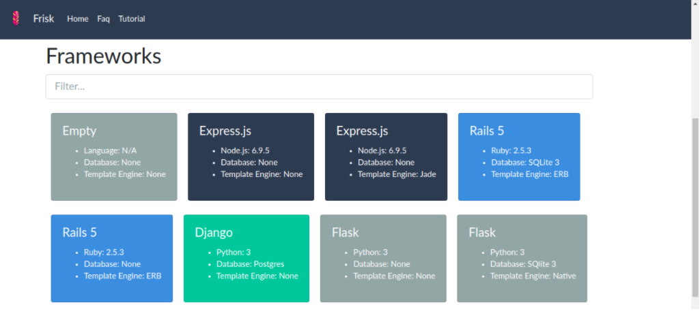
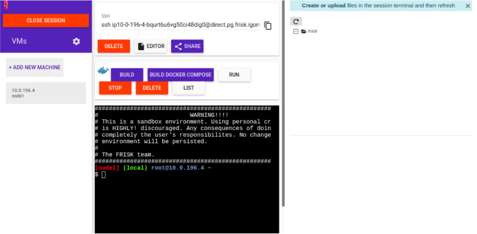

# Referêncial Teórico

## Software livre: Visão

## Tecnologias em software

### Github

## Barreiras enfrentadas por novatos em projetos de software

## Problemas para montar ambiente e replicar issues

## Virtualização em Software Livre

### FRISK

O Frisk é uma plataforma digital baseada no sistema do *Play with Docker*, contudo, garante ao usuário um controle sem dependência de sessões, ou seja, um uso específico de tempo que é atualizado quando chega ao fim de forma automática, ele também possui a funcionalidade do editor de arquivos integrado diretamente na tela de sessões, com mais botões que rodam comandos mais usados no Docker, além de sua principal funcionalidade, compartilhamento de sessão e áreas de trabalho. Como mostrado na FIGURA

o sistema disponibiliza alguns cards, áreas de trabalho com um arquivo docker pré-configurado para determinadas versões de linguagens e banco de dados, também sendo possível que p usuário crie um em branco, realize as instalações manualmente.

O compartilhamento do FRISK acontece sendo armazenado uma versão *hash* em um banco de dados na AWS (*Amazon Web Services*), um serviço de computação em nuvem, ao clicar em compartilhar uma sessão, é gerado um arquivo de tamanho reduzido com as informações de arquivos e instalações feitas na sessão e guardado com um id de compartilhamento no banco de dados na nuvem, ao abrir o link compartilhado da sessão, a plataforma encontra a sessão guardada e restaura no ambiente de sessão. Na FIGURA

é possível visualizar um ambiente montado por um link compartilhado. De forma prática, no contexto de virtualização de tarefas, a comunidade de um projeto cria uma área de trabalho na plataforma que possui as configurações para rodar o projeto, e compartilha dentro de uma discussão para resolver alguma determinada tarefa, o usuário abre o ambiente online, sem a necessidade de baixar nada na sua máquina local, a partir deste ponto, ele já está pronto para resolver o problema proposto pela comunidade. Um diferencial sobre o compartilhamento de uma sessão é que é possível criar marcos de progresso, por exemplo, um usuário conseguiu encontrar o motivo de aparecimento de um *bug*, mas não foi capaz de resolve-lo por completo, assim, ele pode compartilhar a sessão com o ponto que conseguiu atingir e passar o resto da tarefa para outro desenvolvedor na comunidade.

Após revolver uma determinada tarefa, o novato pode compartilhar sua sessão e criar uma branch na comunidade escrevendo diretamente o que foi mudado para atingir a resolução esperada, sem existir a necessidade de fazer o setup do projeto em sua máquina local.

### Trabalhos relacionados com replicação de issues e posts usando docker

## Considerações finais